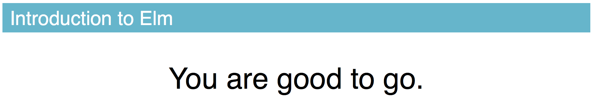

# Elm Curriculum

<em>This work is licensed under the <a rel="license" href="http://creativecommons.org/licenses/by/4.0/">Creative Commons Attribution 4.0 International License</a>.</em>

Portions of this repository have been imported and/or adapted from [Richard Feldman's Elm Workshop](https://github.com/rtfeldman/elm-workshop).

## Installation

1. Install the [Atom IDE](https://atom.io/).

2. Add the [Elm Language Plugin for Atom](https://atom.io/packages/language-elm).

3. Install the [Elm Runtime](https://guide.elm-lang.org/install.html).

4. Install [Node.js](http://nodejs.org) 6.9.2 or higher.

5. Not required, but **highly** recommended:
    1. Install [elm-format](https://github.com/avh4/elm-format#installation-).
    2. Install the [atom-beautify](https://atom.io/packages/atom-beautify) plugin in Atom.
    3. Go to the packages settings for `atom-beautify`, toggle open the "Elm" section, and check the "Beautify on Save" button.

6. Install `elm-test` and `elm-live` via NPM:

```bash
npm install -g elm-test elm-live@2.6.1
```

**Note to Mac OS X users:** If step 4 gives you an `EACCESS` error, try [this fix](https://docs.npmjs.com/getting-started/fixing-npm-permissions):

```bash
sudo chown -R $(whoami) $(npm config get prefix)/{lib/node_modules,bin,share}
```

Then re-run step 4.

## Clone this Repository

Use SourceTree or GitHub Desktop to clone this repository, or run this in your terminal:

```bash
git clone https://github.com/mbuscemi/elm-curriculum
cd elm-curriculum
```

**Note:** Tab characters are syntax errors in Elm code, so make sure Atom is set to use spaces for this class!

## Verify Your Setup

Run this to install packages:

```bash
elm-package install --yes
```

Once that succeeds, run this to verify everything:

```bash
elm-live Main.elm --open --pushstate --output=elm.js
```

A browser should open, and you should see this in it:



If things aren't working, your instructor will be happy to help!
